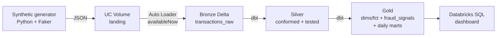

# Transaction Intelligence Lakehouse

> Near-real-time **financial transaction intelligence platform** built entirely on
> **Databricks Free Edition** — synthetic source → Auto Loader bronze → dbt silver/gold
> medallion → **rule-based** fraud signals + customer/merchant analytics → Databricks SQL
> dashboard. Cloud-native, serverless, zero local infrastructure.

This is a **data engineering** portfolio project. It builds the *platform that powers*
fraud analytics (ingestion, conformance, feature/aggregation logic, rule-based scoring,
serving). It does **not** train an ML model.

> Status: scaffolding (Phase 0). Built incrementally — see [`BUILD_SPEC.md`](./BUILD_SPEC.md)
> for the full plan and [`docs/architecture.md`](./docs/architecture.md) for the design.

---

## Architecture at a glance



---

## Skills demonstrated

- **PySpark Structured Streaming** + **Auto Loader** (`cloudFiles`, directory listing, `availableNow`)
- **Delta Lake** on **Unity Catalog** (managed tables + Volumes, no cloud mounts)
- **Medallion architecture** (bronze → silver → gold)
- **dbt Core** (`dbt-databricks`) transformations + **data quality testing**
- **Rule-based fraud detection** with SQL window functions (velocity, impossible travel, amount anomaly, high-risk merchant, card testing)
- **Databricks Workflows** orchestration via **Asset Bundles (DAB)**
- **Terraform** IaC (`databricks` provider)
- **GitHub Actions** CI/CD
- **Databricks SQL** dashboarding (+ optional Genie / LangGraph NL→SQL)

---

## Repository structure

```
.
├── README.md
├── BUILD_SPEC.md                 # full build specification
├── pyproject.toml                # deps: faker, pyspark[opt], dbt-databricks[opt], pytest[dev]
├── databricks.yml                # DAB root (Phase 6)
├── generator/                    # synthetic source (Phase 1)
│   ├── config.py
│   ├── reference_data.py
│   └── generate_transactions.py
├── ingestion/
│   └── bronze_autoloader.py      # Auto Loader -> bronze (Phase 3)
├── dbt/                          # silver + gold transformations (Phases 4-5)
│   ├── dbt_project.yml
│   ├── profiles.yml.example
│   ├── models/{silver,gold}/
│   └── tests/
├── infra/terraform/              # catalog, schemas, volume, grants (Phase 2)
├── resources/                    # DAB job definition (Phase 6)
├── tests/                        # pytest unit tests (Phase 1)
├── .github/workflows/            # CI/CD (Phase 7)
└── docs/architecture.md
```

---

## Databricks Free Edition setup

This project targets **Databricks Free Edition** — a permanent, serverless-only Databricks
workspace that requires **no cloud account** and **no payment method**.

1. **Sign up** for the Free Edition at the Databricks website (search "Databricks Free
   Edition"). You get one serverless workspace with Unity Catalog enabled and a single
   2X-Small SQL warehouse.
2. **No cloud account needed.** Compute is serverless and fully managed — there are no
   clusters to configure, no S3/ADLS buckets to mount.
3. **Understand the limits** (they shape every design choice here):
   - Serverless compute only; Python & SQL only (no Scala/RDDs/GPU/custom clusters).
   - All storage is Unity Catalog **managed tables** and **Volumes** (`/Volumes/...`).
   - Daily compute quotas — streaming uses `trigger(availableNow=True)` (micro-batch then
     stop), **never** a continuous stream.
4. **Auth (for CLI / dbt / Terraform / CI):** create a **personal access token** in the
   workspace (User Settings → Developer → Access tokens). Export it locally; store it as a
   GitHub Actions secret for CI. **Never commit tokens.**

   ```bash
   export DATABRICKS_HOST="https://<your-workspace>.cloud.databricks.com"
   export DATABRICKS_TOKEN="<your-pat>"     # do not commit
   ```

> Detailed per-phase run instructions are added as each phase lands. See `BUILD_SPEC.md`.

---

## Local development

```bash
python -m venv .venv
. .venv/Scripts/activate        # Windows PowerShell: .venv\Scripts\Activate.ps1
pip install -e ".[dev]"          # add ",spark,dbt" extras as needed per phase

pytest                           # generator unit tests (Phase 1+)
```

---

## License

MIT — non-commercial portfolio project. Fictional data only.
