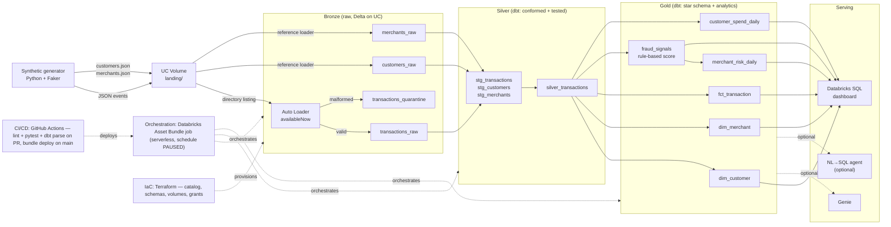

# Transaction Intelligence Lakehouse

A near-real-time **fraud-analytics lakehouse** built end-to-end on **Databricks Free Edition**.
A synthetic source emits card transactions; the platform ingests them with Auto Loader,
refines them through a **medallion** (bronze → silver → gold) using dbt, derives
**rule-based** fraud signals plus customer/merchant analytics with SQL window functions, and
serves everything through a Databricks SQL dashboard (with optional Genie / NL→SQL access).
This is a **data engineering** portfolio project — it builds the *platform that powers* fraud
analytics; it does **not** train an ML model (signals are deterministic rules, not learned).

---

## Architecture



---

## Architecture at a glance

| Layer | Tech | What it does |
|-------|------|--------------|
| Source | Python + Faker | Generates customers/merchants reference data + JSON transaction events (5 injected fraud patterns) into a UC Volume landing zone |
| Ingestion | Spark Structured Streaming + **Auto Loader** | Directory-listing `cloudFiles`, `trigger(availableNow=True)`, schema-on-read; valid rows → `transactions_raw`, bad rows → `transactions_quarantine`; reference loader fills `customers_raw` / `merchants_raw` |
| Storage | Delta Lake on **Unity Catalog** | Managed tables + Volumes only (landing + `_checkpoints`); no external buckets or mounts |
| Silver | **dbt Core** (`dbt-databricks`) | `stg_*` cleanup/cast/dedup → `silver_transactions` conformed and enriched with customer baseline + merchant risk |
| Gold | **dbt Core** | Star schema (`dim_customer`, `dim_merchant`, `fct_transaction`) + `fraud_signals` (rule-based score) + `customer_spend_daily` + `merchant_risk_daily` |
| Quality | dbt tests + quarantine | `not_null` / `unique` / `relationships` / `accepted_values` + a singular recall-sanity test |
| Orchestration | **Databricks Asset Bundles (DAB)** | One serverless Workflows job, schedule **PAUSED** by default |
| IaC | **Terraform** (`databricks` provider) | Catalog, bronze/silver/gold schemas, landing + checkpoint Volumes, grants |
| CI/CD | **GitHub Actions** | Lint + pytest + offline `dbt parse` on PR; `databricks bundle deploy` on main |
| Serving | Databricks SQL + Genie + optional NL→SQL agent | 8 documented dashboard tiles; Genie/LangGraph access over the gold layer |

---

## Skills demonstrated

- **Auto Loader ingestion** — `cloudFiles` directory-listing, schema-on-read, `availableNow` micro-batch, checkpointing, and a quarantine path for malformed records.
- **Medallion dbt** — staging → conformed silver → gold star schema, with `ref()`/`source()` everywhere and a model-per-concern layout.
- **Rule-based fraud features in SQL** — velocity, impossible travel (haversine + speed), amount z-score, high-risk merchant, and card-testing, computed with **window functions** and combined into a composite weighted `fraud_score` (no ML).
- **Unity Catalog governance via Terraform** — catalog/schemas/volumes/grants as code.
- **DAB orchestration** — a serverless task chain wired through `depends_on`, with a paused schedule to respect quotas.
- **CI/CD** — fast offline checks on every PR; gated bundle deploy on main; no secrets in the repo.
- **NL→SQL guardrails** — a governed, read-only, gold-only natural-language query agent with comment/literal scrubbing and statement validation.

---

## Repository layout

```
.
├── README.md
├── BUILD_SPEC.md                     # full build specification (vision, constraints, model)
├── pyproject.toml                    # base + [dev], [dbt], [spark] extras
├── databricks.yml                    # DAB root (dev/prod targets, serverless)
├── generator/                        # synthetic source
│   ├── config.py                     # env-driven config (paths, volumes, fraud params)
│   ├── reference_data.py             # customers + merchants generation
│   └── generate_transactions.py      # transaction events + 5 injected fraud patterns
├── ingestion/
│   ├── bronze_autoloader.py          # Auto Loader -> transactions_raw (+ quarantine)
│   └── load_reference.py             # reference JSON -> customers_raw / merchants_raw
├── dbt/
│   ├── dbt_project.yml
│   ├── profiles.yml.example          # env_var() driven; no secrets committed
│   ├── macros/generate_schema_name.sql
│   ├── models/
│   │   ├── silver/                   # stg_* + silver_transactions + _silver.yml
│   │   └── gold/                     # dims, fct, fraud_signals, daily marts + _gold.yml
│   └── tests/assert_fraud_recall_sane.sql   # singular recall-sanity test
├── infra/terraform/                  # catalog, schemas, volumes, grants
│   ├── main.tf / variables.tf / outputs.tf / terraform.tfvars.example
│   └── README.md
├── resources/
│   └── transaction_pipeline.job.yml  # DAB job: task chain, paused schedule
├── dashboards/                       # 8 Databricks SQL tile queries (01..08)
├── ai/                               # optional NL->SQL agent (isolated deps)
│   ├── nl_to_sql_agent.py / schema_context.py / requirements.txt
│   └── README.md
├── docs/
│   ├── architecture.md               # deeper technical design
│   ├── dashboard.md                  # SQL tiles + in-product build walkthrough
│   └── genie.md                      # Genie space setup
├── scripts/verify.ps1                # phase-aware verification harness
├── tests/                            # pytest (generator, ingestion, NL->SQL guardrails)
└── .github/workflows/                # ci.yml + deploy.yml
```

---

## Quickstart

### Local development (no cloud account required)

```bash
python -m venv .venv
. .venv/Scripts/activate            # Windows PowerShell: .venv\Scripts\Activate.ps1
pip install -e ".[dev,dbt]"          # add ",spark" to exercise ingestion locally

python -m generator.generate_transactions   # writes synthetic JSON to ./_landing
pytest                                       # generator + guardrail unit tests

cd dbt && cp profiles.yml.example profiles.yml
dbt deps && dbt parse                        # fully offline — never connects to a warehouse
```

### Databricks Free Edition

1. **Provision Unity Catalog with Terraform** (`infra/terraform/`): `terraform init && terraform apply` creates the catalog, bronze/silver/gold schemas, the landing + `_checkpoints` Volumes, and grants. See [`infra/terraform/README.md`](./infra/terraform/README.md).
2. **Set the dbt profile via env vars** (the committed `profiles.yml.example` reads `DATABRICKS_HOST`, `DATABRICKS_HTTP_PATH`, `DATABRICKS_TOKEN` through `env_var()` — never commit secrets):

   ```bash
   export DATABRICKS_HOST="https://<workspace>.cloud.databricks.com"
   export DATABRICKS_HTTP_PATH="/sql/1.0/warehouses/<warehouse-id>"
   export DATABRICKS_TOKEN="<your-personal-access-token>"   # do not commit
   ```

3. **Deploy and run the DAB bundle**:

   ```bash
   databricks bundle deploy -t dev
   databricks bundle run transaction_pipeline -t dev
   ```

   The job chains `generate_batch → load_reference → bronze_ingest → dbt_build → quality_gate` on serverless compute.
4. **Build the dashboard** from the 8 documented SQL tiles — see [`docs/dashboard.md`](./docs/dashboard.md).
5. **(Optional) enable Genie** over the gold tables ([`docs/genie.md`](./docs/genie.md)) or run the governed NL→SQL agent ([`ai/README.md`](./ai/README.md)).

For the deeper design, read [`docs/architecture.md`](./docs/architecture.md).

---

## Data-quality story

- **dbt tests** enforce keys (`not_null`, `unique`), referential integrity (`relationships`), and controlled vocabularies (`accepted_values` for `channel`, `merchant_category`, `risk_tier`) across silver and gold.
- A bronze **quarantine** table captures schema-mismatched / null-key records instead of dropping them.
- A **singular recall-sanity test** (`assert_fraud_recall_sane.sql`) is the **only** place permitted to read `is_fraud_label`. The injected `is_fraud_label` is **ground truth for validation only** — the detection logic (`fraud_signals`) is derived purely from observable features and **never** reads the label.

---

## Free Edition constraints honored

- **Serverless only** — no custom clusters, instance configs, or GPU; Python + SQL.
- **Unity Catalog Volumes** for all file IO (`/Volumes/...`); **no external cloud storage** or mounts.
- **`availableNow` micro-batch** ingestion — never an always-on continuous stream.
- **Paused schedule** on the orchestration job so it never burns quota unattended.
- Modest data volumes and a single serverless SQL warehouse.

---

## License

MIT — non-commercial portfolio project. Fictional data only.
