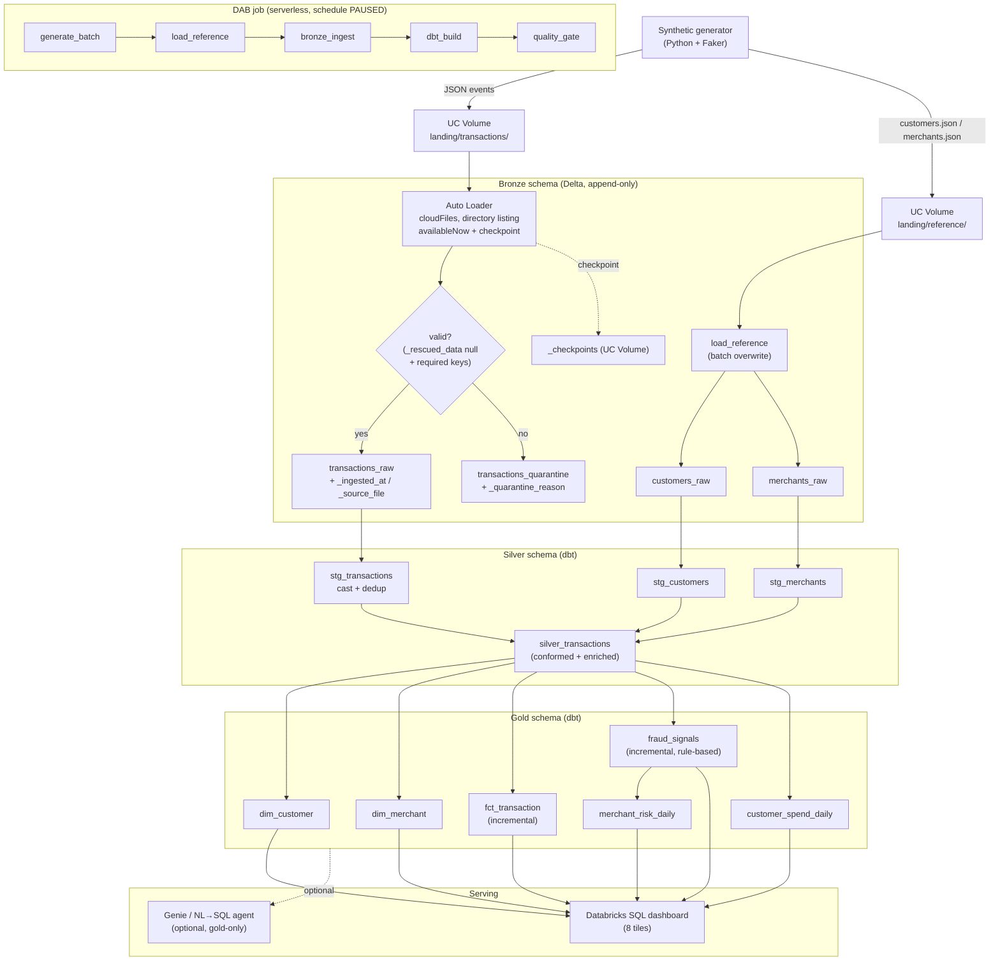

# Architecture — Transaction Intelligence Lakehouse

A cloud-native, serverless **medallion lakehouse** on **Databricks Free Edition** that turns a
synthetic stream of card transactions into **rule-based** fraud signals and customer/merchant
analytics, served through a Databricks SQL dashboard. This document is the deeper technical
companion to the top-level [`README.md`](../README.md).

---

## 1. End-to-end flow



The orchestration task chain maps 1:1 onto the layers: `generate_batch` (generator) →
`load_reference` (reference loader) → `bronze_ingest` (Auto Loader) → `dbt_build` (silver +
gold + tests) → `quality_gate` (re-run critical tests as a hard gate).

---

## 2. Component breakdown

### 2.1 Synthetic source (`generator/`)
Config-driven (`generator/config.py`, all tunables via `TIL_*` env vars). Generates ~200
customers, ~40 merchants, and ~5,000 transaction events spread over a trailing window, with a
configurable fraud ratio (~1.5%). Five fraud patterns are injected — velocity,
impossible_travel, amount_anomaly, high_risk_merchant, card_testing — each tagged with
`is_fraud_label = true` (validation ground truth only). Output is JSON to a UC Volume landing
zone locally (`./_landing`) or on Databricks (`/Volumes/...`).

### 2.2 Bronze ingestion (`ingestion/`)
- **Auto Loader** (`bronze_autoloader.py`) reads `landing/transactions/` via `cloudFiles` in
  **directory-listing** mode (`cloudFiles.useNotifications = false`) with an **explicit
  schema-on-read** (timestamps kept as strings; casting deferred to silver) and a
  `_rescued_data` column for unexpected fields.
- `trigger(availableNow=True)` runs a single micro-batch then stops; the checkpoint lives on a
  UC Volume so re-runs are idempotent and exactly-once.
- A `foreachBatch` splitter routes each row: structurally valid rows (no rescued data and all
  of `transaction_id`/`event_timestamp`/`customer_id` present) append to `transactions_raw`
  with `_ingested_at` / `_source_file` / `_batch_id` metadata; everything else goes to
  `transactions_quarantine` with a `_quarantine_reason` — bad records are preserved, not lost.
- **Reference loader** (`load_reference.py`) batch-overwrites the small, slowly-changing
  `customers_raw` / `merchants_raw` tables from the landing reference JSON arrays.

### 2.3 Silver (`dbt/models/silver/`)
- `stg_transactions` type-casts, conforms, and **deduplicates** to one row per
  `transaction_id`; `stg_customers` / `stg_merchants` conform the reference dimensions.
- `silver_transactions` joins transactions to the customer spend baseline + home geo and the
  merchant risk tier + geo, so gold can derive every signal without re-joining.
- `_silver.yml` declares the bronze sources and enforces tests: `not_null`/`unique` keys,
  `accepted_values` for `channel`/`merchant_category`/`risk_tier`, and `relationships` to the
  staged dimensions. `is_fraud_label` is carried through for validation only.

### 2.4 Gold (`dbt/models/gold/`)
- **Dimensions/fact:** `dim_customer` (spend baseline + home geo), `dim_merchant` (category,
  geo, risk tier), `fct_transaction` (transaction grain, **incremental** on `event_timestamp`,
  intentionally clean of `is_fraud_label`).
- **`fraud_signals`** — the rule-based feature/scoring model (**incremental**, merge on
  `transaction_id`). Window functions over per-card history compute the features; the
  incremental watermark is applied only at the very end so re-runs still see prior context for
  the windows. Feature/flag definitions:
  - `flag_velocity` — `velocity_count_5m >= 5` (count over a trailing 5-minute `range` window).
  - `flag_impossible_travel` — implied speed `> 900 km/h` between consecutive card txns (great-circle/haversine distance ÷ time gap from `lag()`).
  - `flag_amount_anomaly` — `amount_zscore >= 6` versus the customer's `typical_txn_amount` / `typical_txn_std` baseline.
  - `flag_high_risk_merchant` — merchant `risk_tier = 'high'`.
  - `flag_card_testing` — a large charge (`amount >= 100`) following `>= 3` tiny probe txns (`amount < 2`) within 10 minutes.
  - **Composite score:** `fraud_score = 0.25·velocity + 0.30·impossible_travel + 0.20·amount_anomaly + 0.10·high_risk_merchant + 0.15·card_testing`; `is_flagged_fraud = fraud_score >= 0.25`.

### 2.5 Marts (`dbt/models/gold/`)
- `customer_spend_daily` — one row per customer per day: `txn_count`, `total_amount`, `avg_amount`.
- `merchant_risk_daily` — one row per merchant per day: `txn_count`, `flagged_txn_count`, `flagged_rate` (driven by `fraud_signals`).
- `_gold.yml` documents and tests every model and declares a `fraud_dashboard` **exposure**.

### 2.6 Serving
A Databricks SQL dashboard built from the 8 documented tile queries in `dashboards/`
(`docs/dashboard.md`). Optionally, Genie (`docs/genie.md`) or the governed LangGraph NL→SQL
agent (`ai/`) provide natural-language access — restricted to **read-only, gold-only**
queries with comment/literal scrubbing and statement validation.

---

## 3. Data model summary

| Table | Layer | Grain |
|-------|-------|-------|
| `transactions_raw` / `transactions_quarantine` | bronze | one row per ingested (valid / rejected) event |
| `customers_raw` / `merchants_raw` | bronze | one row per reference entity |
| `stg_transactions` | silver | one row per `transaction_id` (deduped) |
| `silver_transactions` | silver | one enriched row per transaction |
| `dim_customer` / `dim_merchant` | gold | one row per customer / merchant |
| `fct_transaction` | gold | one row per transaction |
| `fraud_signals` | gold | one row per transaction (features + score) |
| `customer_spend_daily` | gold | one row per customer per day |
| `merchant_risk_daily` | gold | one row per merchant per day |

### Unity Catalog layout

```
catalog: txn_intelligence            # configurable via TIL_CATALOG / var.catalog_name
├── bronze   (schema)
│   ├── transactions_raw             # Delta, append-only + ingestion metadata
│   ├── transactions_quarantine      # malformed / null-key records
│   ├── customers_raw / merchants_raw
│   ├── landing      (VOLUME)        # /Volumes/txn_intelligence/bronze/landing
│   └── _checkpoints (VOLUME)        # Auto Loader / streaming checkpoints
├── silver  (schema)
│   ├── stg_transactions / stg_customers / stg_merchants
│   └── silver_transactions
└── gold     (schema)
    ├── dim_customer / dim_merchant / fct_transaction
    ├── fraud_signals
    ├── customer_spend_daily
    └── merchant_risk_daily
```

---

## 4. Fraud-detection boundary principle

The platform draws a hard line between **detection** and **validation**:

- Detection (`fraud_signals` and everything served downstream) is **rule-based SQL** over
  observable features only — velocity, geo/speed, amount z-score, merchant risk, card testing.
- The injected `is_fraud_label` is **ground truth for validation only**. The **only** place
  permitted to read it is the singular test `assert_fraud_recall_sane.sql`, which fails if
  recall of labelled frauds drops below 0.30. The label never enters detection logic,
  `fct_transaction`, or any served gold mart.

This keeps the project honestly a *data-engineering* exercise (deterministic features and
scoring) rather than a supervised ML one, while still giving an objective quality signal.

---

## 5. Operational notes

- **Serverless only.** Python tasks run on a serverless `environments` spec; dbt tasks bind to
  the existing serverless SQL warehouse (`${var.warehouse_id}`). No clusters are provisioned.
- **Paused schedule.** The DAB job carries an hourly cron but ships `PAUSED` so it never burns
  Free Edition quota unattended; run it on demand with `databricks bundle run
  transaction_pipeline` or un-pause deliberately.
- **Incremental models.** `fct_transaction` and `fraud_signals` are incremental on
  `event_timestamp` (merge on `transaction_id`), so re-runs process only newly arrived events
  while window features still see prior per-card context.
- **Idempotency.** Auto Loader checkpoints (on a UC Volume) guarantee exactly-once bronze
  appends; reference loads overwrite; dbt merges are re-runnable — the whole pipeline is safe
  to re-execute.
- **IaC + CI/CD.** Terraform owns the catalog/schemas/volumes/grants; GitHub Actions runs
  lint + pytest + offline `dbt parse` on every PR and a gated `bundle deploy` on main. No
  secrets, profiles, or `.tfstate` are committed.
- **Free Edition guardrails.** `availableNow` micro-batch (never continuous), all file IO via
  `/Volumes/...` (no external buckets/mounts), modest data volumes, single SQL warehouse.
