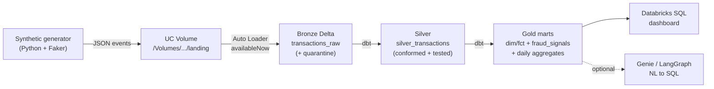

# Architecture — Transaction Intelligence Lakehouse

> Status: **stub** (Phase 0). Filled in incrementally; finalized in Phase 10.

## 1. Overview

A cloud-native, serverless **medallion lakehouse** on **Databricks Free Edition** that
turns a synthetic stream of card transactions into rule-based fraud signals and
customer/merchant analytics, served through a Databricks SQL dashboard.



## 2. Components

| Layer | Tech | Notes |
|-------|------|-------|
| Source | Python + Faker | Writes JSON to a UC Volume landing path; 5 injected fraud patterns |
| Ingestion | Spark Structured Streaming + Auto Loader | Directory-listing mode, `trigger(availableNow=True)` |
| Storage | Delta on Unity Catalog | Managed tables + Volumes only (no external buckets) |
| Transform | dbt Core + `dbt-databricks` | Silver conformance, gold star schema + fraud rules |
| Quality | dbt tests + quarantine | not_null / unique / relationships / accepted_values + singular tests |
| Orchestration | Databricks Asset Bundles | Workflows job, serverless, paused schedule |
| IaC | Terraform (`databricks` provider) | Catalog, schemas, volume, grants |
| CI/CD | GitHub Actions | pytest + dbt build on PR; `bundle deploy` on main |

## 3. Unity Catalog layout

```
catalog: txn_intelligence            # configurable (var: catalog_name)
├── bronze   (schema)
│   ├── transactions_raw             # Delta, append-only + ingestion metadata
│   ├── transactions_quarantine      # malformed records
│   ├── landing      (VOLUME)        # /Volumes/txn_intelligence/bronze/landing
│   └── _checkpoints (VOLUME)        # Auto Loader checkpoints
├── silver  (schema)
│   ├── customers / merchants        # conformed dimensions (seeded from reference data)
│   └── silver_transactions
└── gold     (schema)
    ├── dim_customer / dim_merchant / fct_transaction
    ├── fraud_signals
    ├── customer_spend_daily
    └── merchant_risk_daily
```

## 4. Data flow & contracts

_To be expanded per phase (event schema, dedup keys, fraud rule definitions, scoring)._

## 5. Free Edition guardrails

- Serverless-only; `availableNow` micro-batch ingestion (never continuous).
- Modest data volumes (thousands–low millions of rows).
- All file IO via `/Volumes/...`; no cloud mounts.
